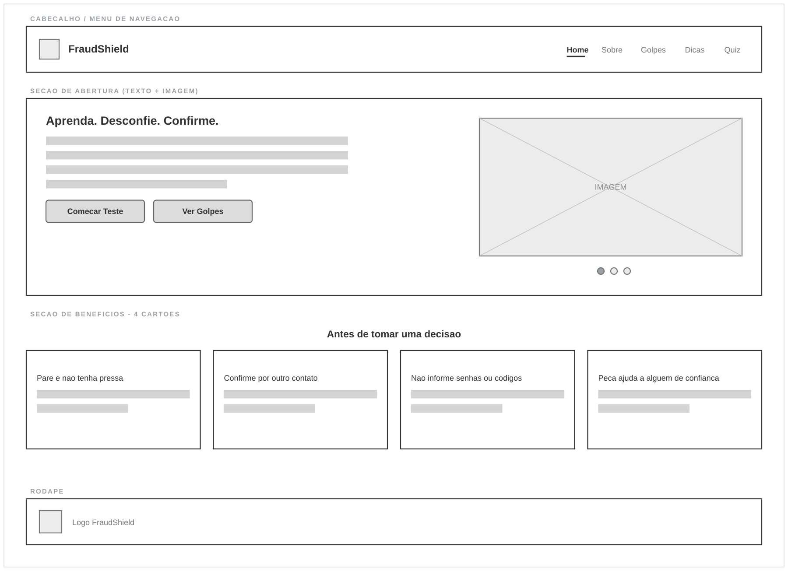
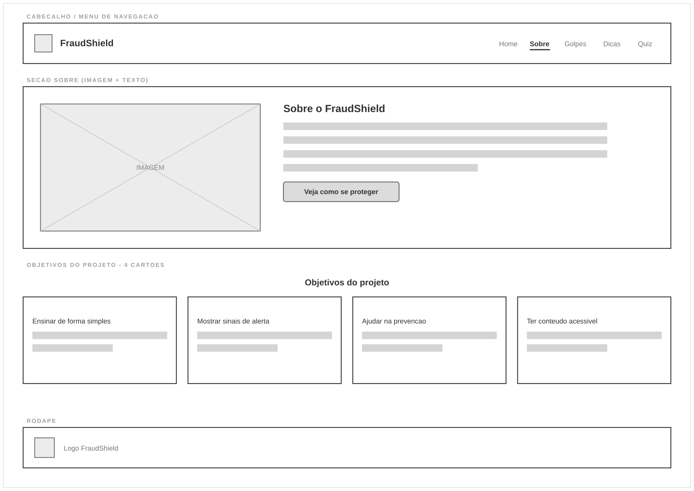
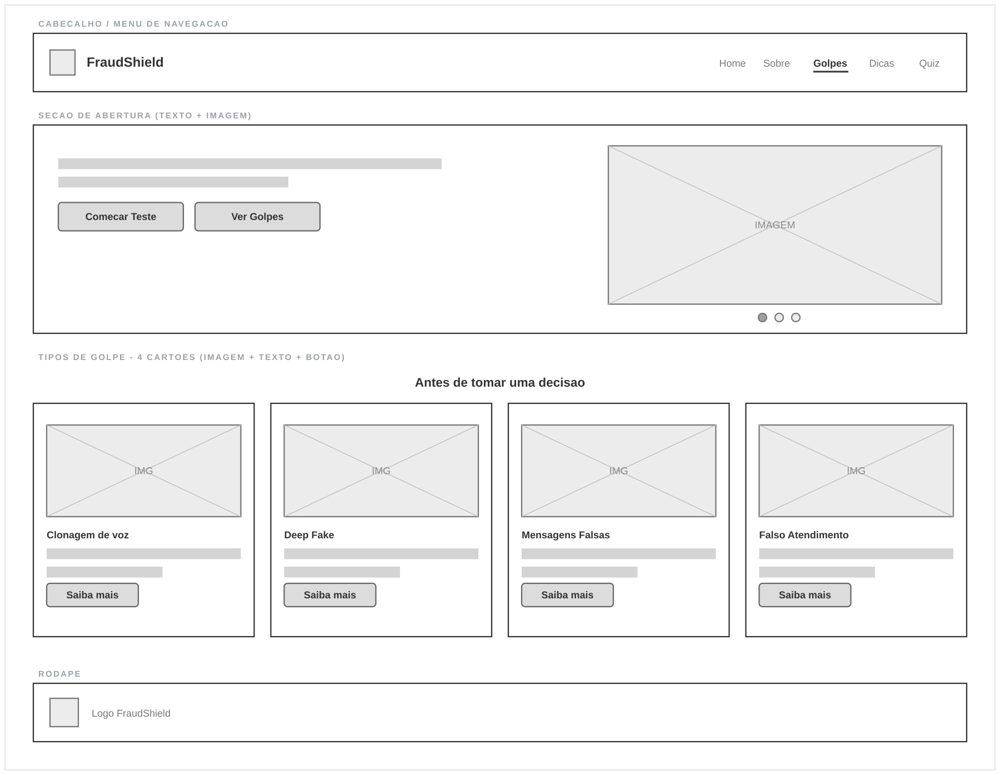
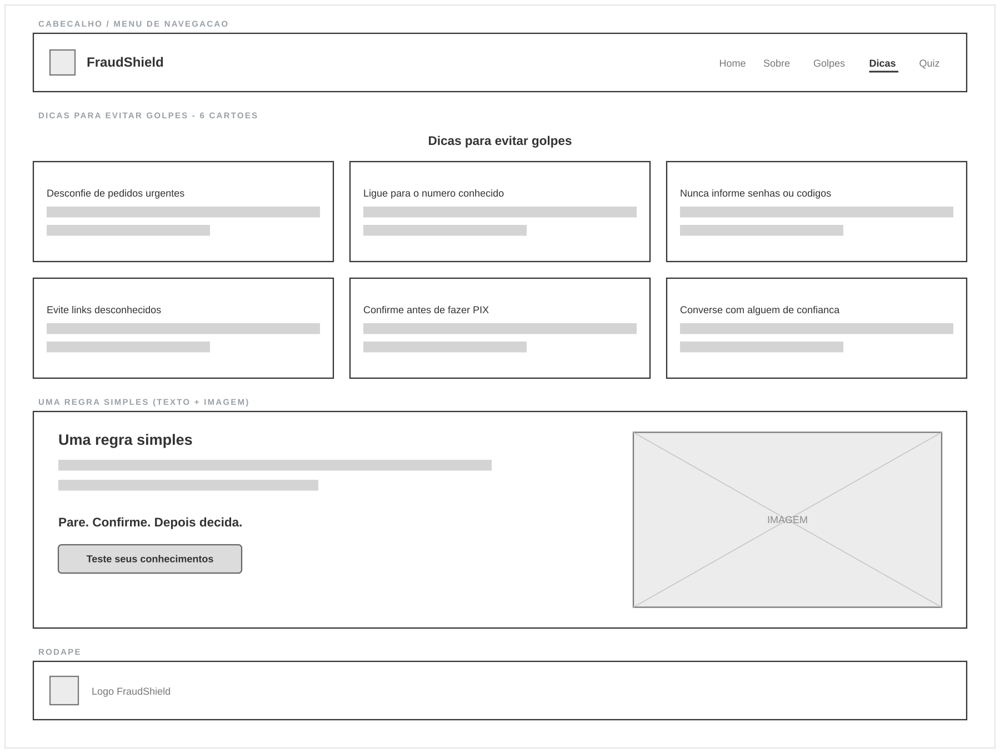
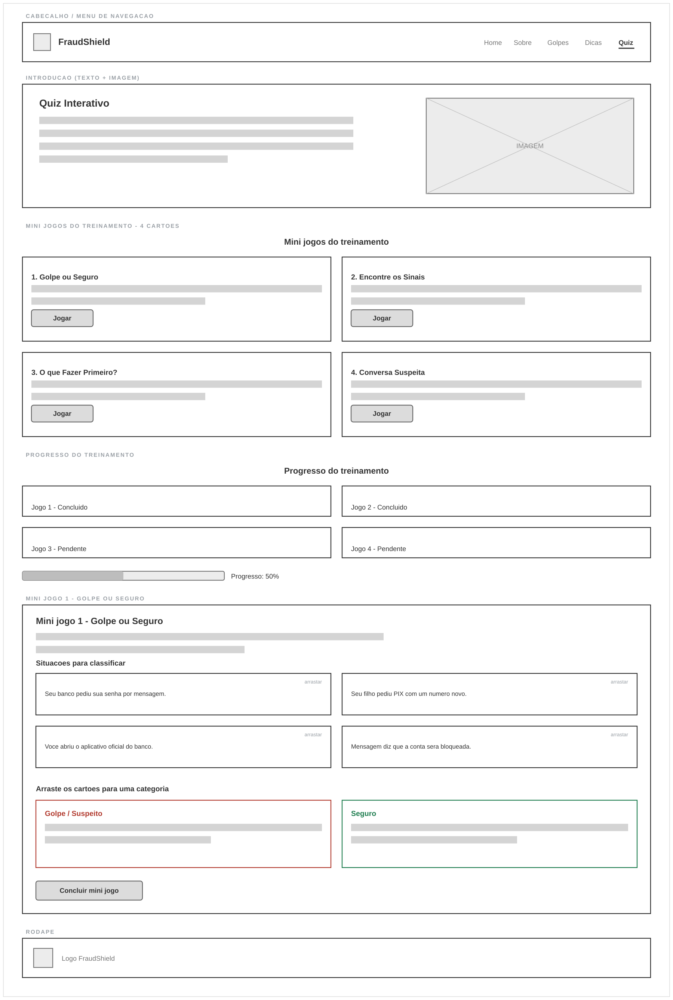
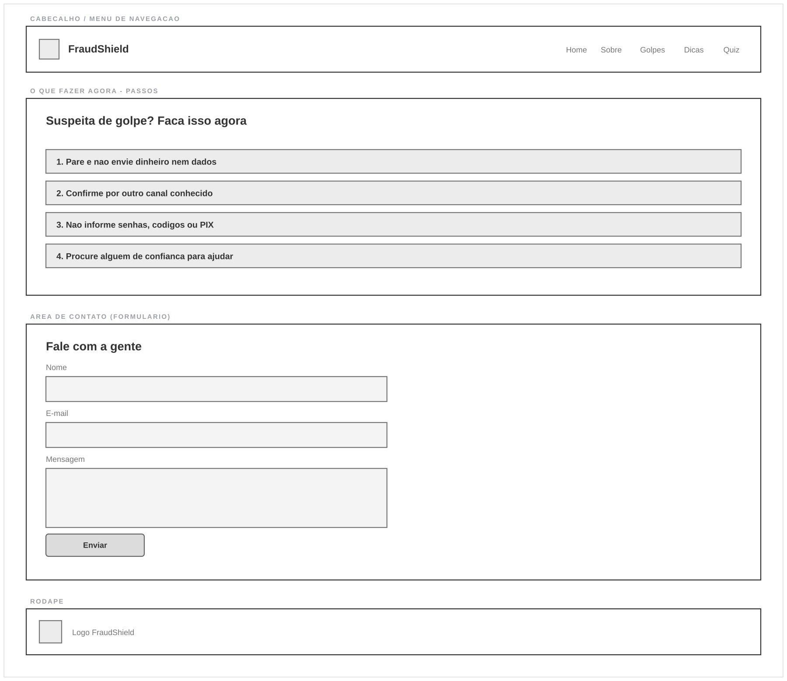

# FraudShield SERÁ ADICIONADO MAIS FUNCIONALIDADES, VERSÃO ANTIGA.

## Integrantes

- **Nome:** Murilo Lobato — **RA:** 10752958
  

**GitHub:** https://github.com/FrankHutH/FraudShield.git

---

## Processo de ideação

O **FraudShield** surgiu da necessidade de ajudar pessoas idosas a reconhecer e evitar golpes digitais que utilizam Inteligência Artificial.

Com o avanço da IA, golpes estão se tornando mais convincentes. Criminosos podem utilizar clonagem de voz, deepfakes, imagens falsas e mensagens produzidas por IA para se passar por familiares, empresas ou instituições confiáveis.

Pessoas idosas podem ter mais dificuldade para acompanhar essas mudanças tecnológicas. Por isso, a proposta do FraudShield é apresentar informações de forma **simples, direta e acessível**, sem exigir conhecimento técnico.

O projeto tem como objetivo ensinar o usuário a identificar sinais de alerta, desconfiar de situações de urgência e confirmar informações antes de enviar dinheiro ou fornecer dados pessoais.

A ideia central do projeto pode ser resumida em uma regra:

> **Pare, confirme e só depois tome uma decisão.**

O site será pensado com textos objetivos, navegação simples, botões grandes e exemplos próximos de situações reais. Além do conteúdo educativo, o projeto prevê interações para tornar o aprendizado mais prático, como um **quiz para identificação de golpes** e uma área de **dicas expansíveis**.

---

## Protótipo — Wireframe

O protótipo abaixo representa a estrutura inicial das principais telas do **FraudShield**. Os wireframes mostram a organização das informações e das funcionalidades antes do desenvolvimento visual e da implementação do site.

### 1. Página inicial

Apresenta rapidamente a proposta do FraudShield e direciona o usuário para os principais conteúdos.



### 2. Sobre o projeto

Explica o propósito do FraudShield e por que o projeto é importante para a segurança digital.



### 3. Tipos de golpes

Organiza os principais golpes relacionados ao uso de Inteligência Artificial, como clonagem de voz, deepfakes e falso familiar.



### 4. Dicas de segurança

Apresenta orientações rápidas. A proposta é que cada dica possa ser expandida pelo usuário para mostrar mais informações.



### 5. Quiz

O quiz apresentará situações fictícias para que o usuário escolha a atitude mais segura. Depois da resposta, o site poderá explicar por que aquela escolha está correta ou incorreta.



### 6. Ajuda e contato

Reúne orientações imediatas sobre o que fazer diante de uma possível tentativa de golpe e apresenta uma área de contato.



---

## Estrutura do projeto

```text
FraudShield/
├── index.html            página inicial
├── sobre.html             sobre o projeto
├── golpes.html            tipos de golpes
├── dicas.html             dicas de segurança
├── quiz.html              quiz interativo
├── css/                   um arquivo de estilo por página
│   ├── index.css
│   ├── sobre.css
│   ├── golpes.css
│   ├── dicas.css
│   └── quiz.css
├── img/                   imagens do site (logo e ilustrações)
├── docs/
│   └── wireframes/        wireframes do protótipo (01 a 06)
└── README.md
```

O site é feito apenas com **HTML e CSS**, sem frameworks. Cada página `.html`
carrega o seu próprio `.css` da pasta `css/`.

## Como visualizar

Abra o arquivo `index.html` no navegador, ou publique a pasta pelo **GitHub Pages**
(Settings → Pages → Branch: `main` / `root`).

