<p align="center">
  
</p>

<h1 align="center">FraudShield</h1>


<p align="center">
  <strong>Integrante:</strong> Murilo Lobato — <strong>RA:</strong> 10752958
</p>

---

<p align="center">
  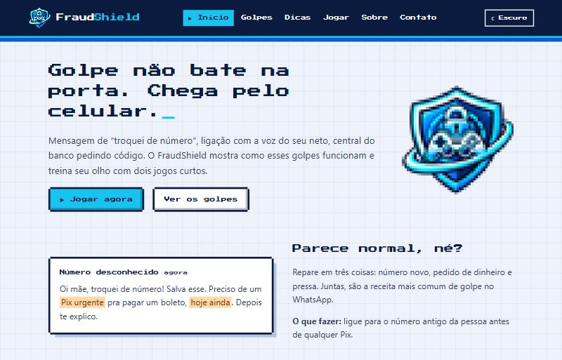
  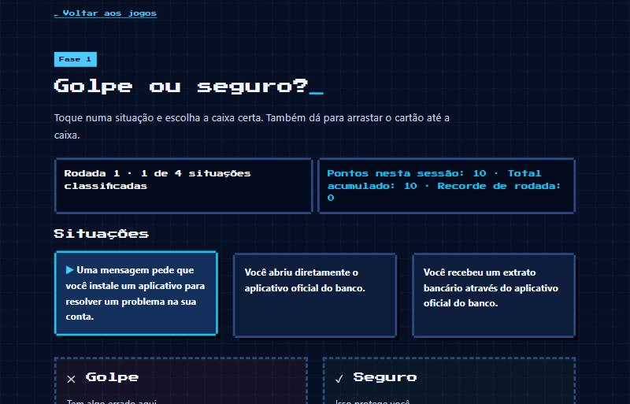
</p>

## Ideação

Os golpes agora usam voz clonada, imagens falsas e mensagens feitas por IA, e as pessoas idosas são as mais atingidas. O FraudShield ensina a se proteger na prática, com conteúdo simples e dois jogos: identificar se uma situação é golpe e achar os sinais de alerta em mensagens suspeitas.

## Caráter extensionista

- Público real, não técnico — foco em pessoas idosas, alvo comum de golpe.
- Gratuito, roda offline/local, pode ser usado em oficina, telecentro, biblioteca.
- Ensina atitude prática (confirmar por outro canal, não repassar senha), não teoria.

## Como abrir

Abra `html/index.html` no navegador. Sem instalar, sem compilar, sem servidor.

## Os jogos

| | Jogo | Como funciona |
|---|---|---|
| **Fase 1** | Golpe ou seguro? | Toque numa situação e escolha a caixa certa (ou arraste o cartão). |
| **Fase 2** | Encontre os sinais | Toque nas palavras suspeitas de uma mensagem e clique em verificar. |

Cada acerto vale 10 pontos. O placar e o recorde ficam salvos no navegador.

## Wireframes

| Início | Sobre | Golpes |
|---|---|---|
| 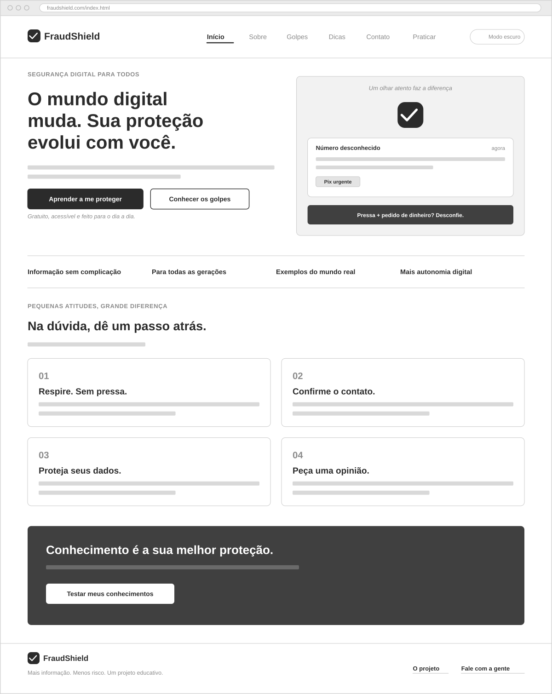 | 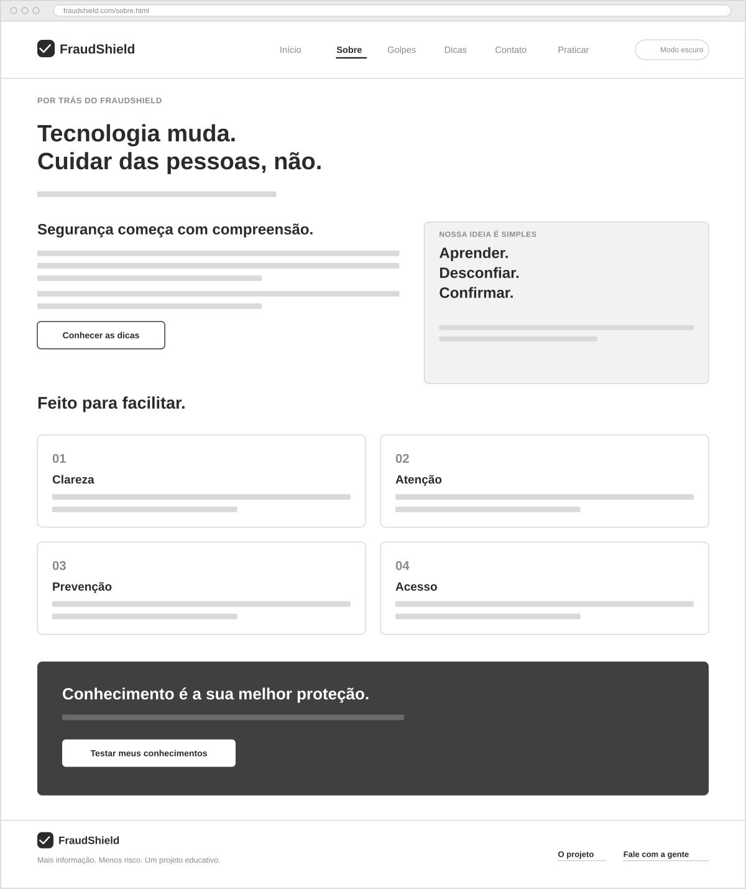 | 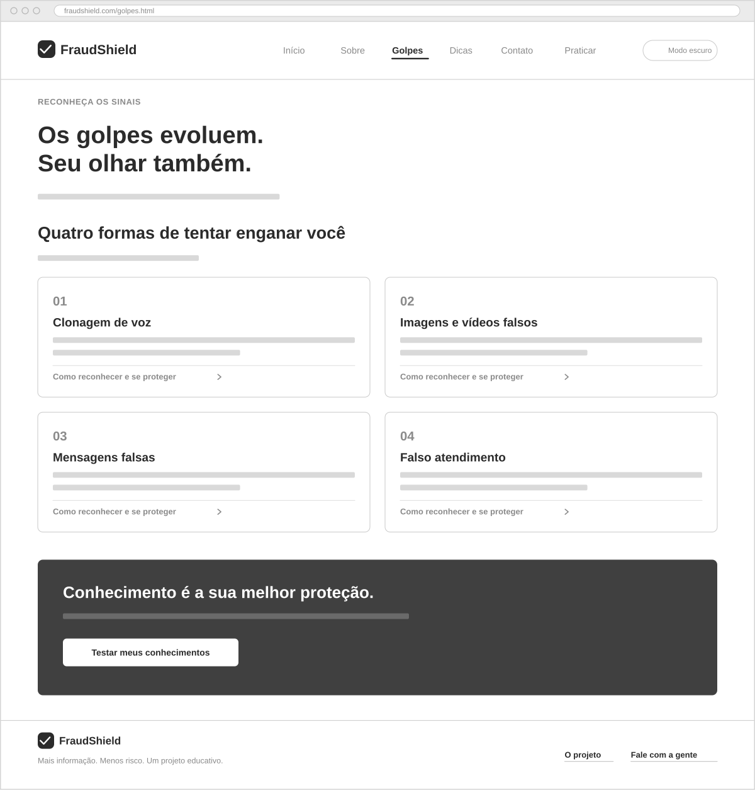 |

| Dicas | Quadro | Quiz |
|---|---|---|
| 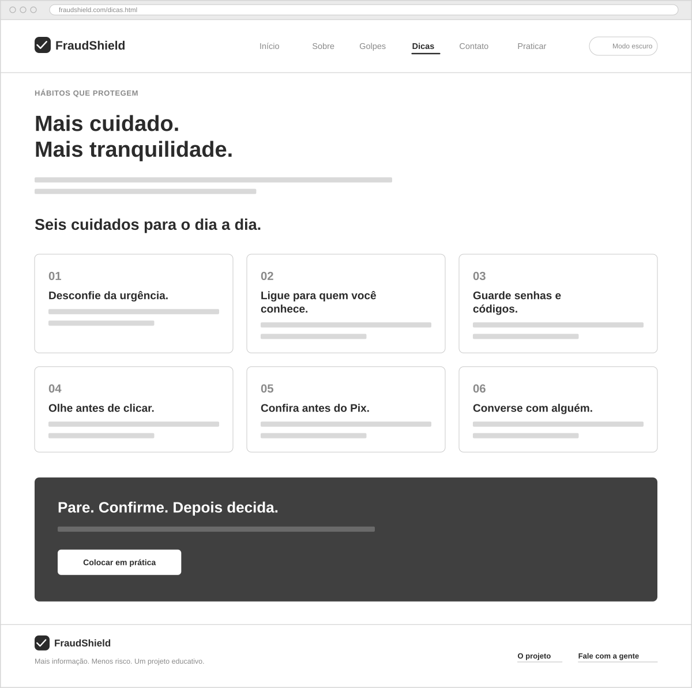 | 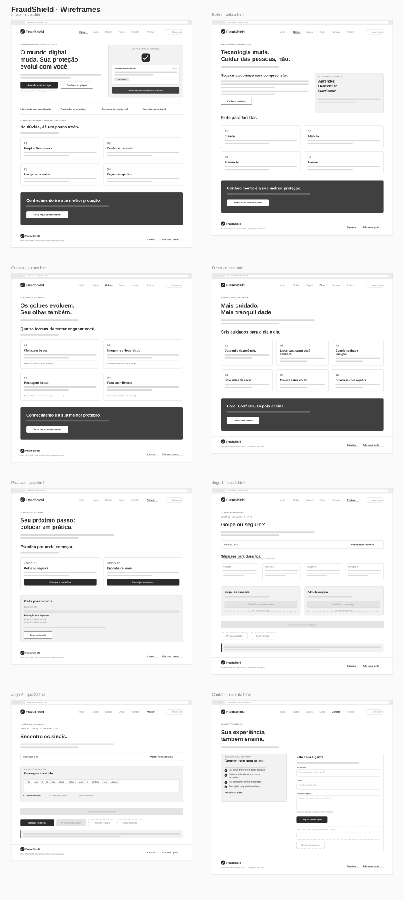 | 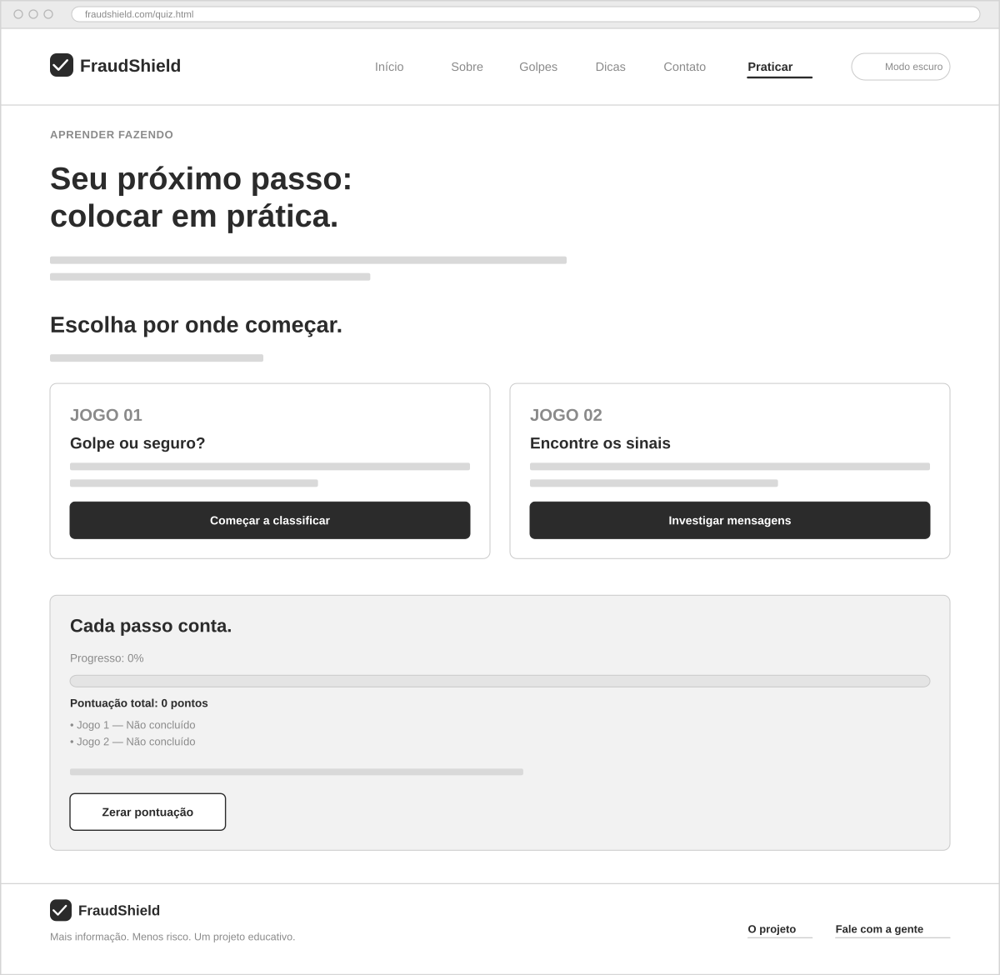 |

| Quiz 1 | Quiz 2 | Contato |
|---|---|---|
| 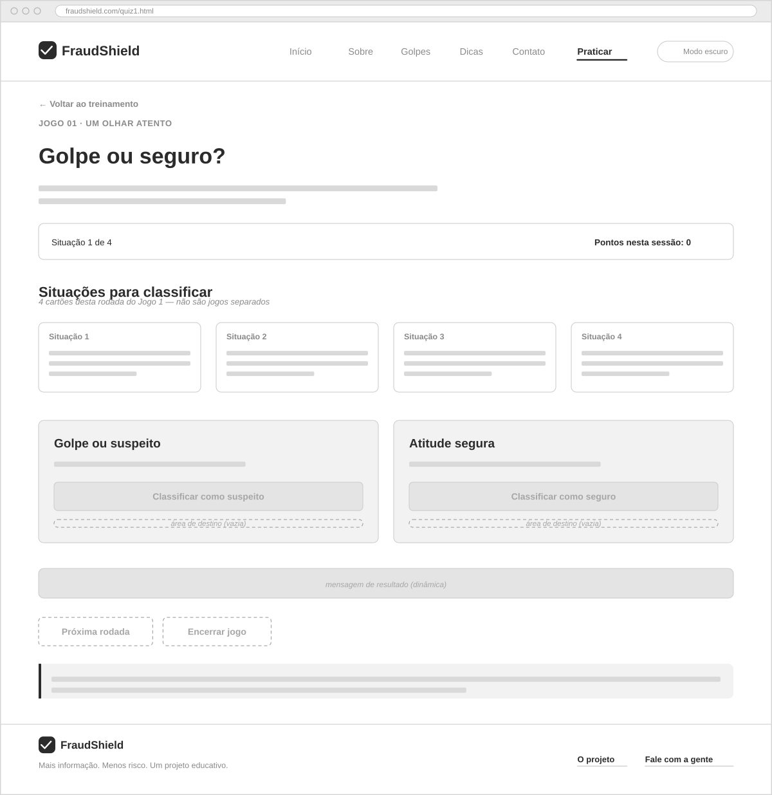 | 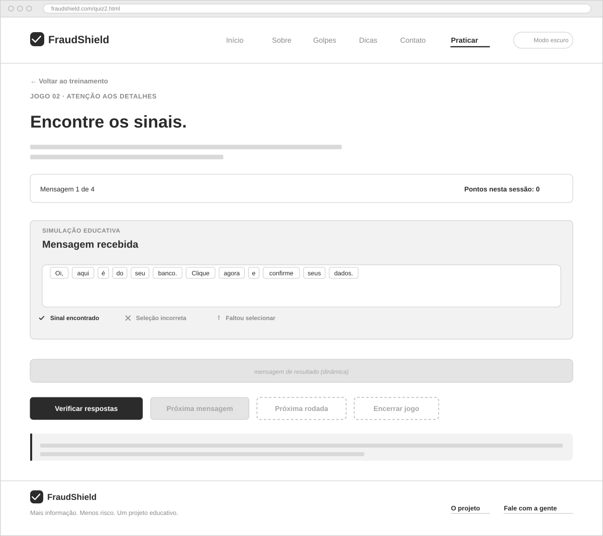 | 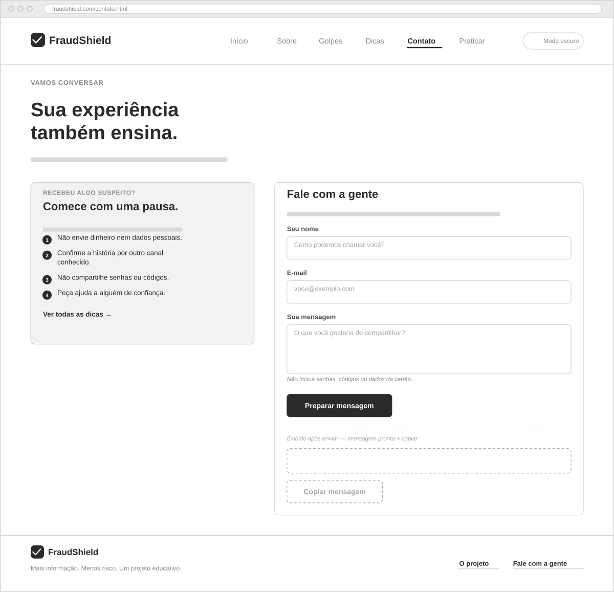 |

Fixou cedo: cabeçalho + menu, hero texto/imagem, 4 cartões de destaque, rodapé simples.

## Estrutura

```
html/            8 páginas, HTML semântico, sem <div>
css/             1 arquivo por página (mesmo nome do html)
img/             logo.png (48px, ampliada em pixel art) e favicon.png
js/tema.js       modo claro/escuro
js/progresso.js  pontos, recorde e conclusão (localStorage)
js/feedback.js   helpers de UI (criar elemento, mostrar resultado)
js/quiz.js       progresso na página de treino
js/quiz1.js      Jogo 1 — Golpe ou seguro?
js/quiz2.js      Jogo 2 — Encontre os sinais
js/dados/        conteúdo dos jogos (situações, mensagens, feedback)
js/contato.js    formulário de demonstração
wireframes/      wireframes de cada página (SVG)
docs/            imagens usadas neste README
```

## Tutorial do código

**HTML** — sem `<div>`; layout feito com `flex`/`grid` direto em tags semânticas (`section`, `ul`, `article`); `details`/`summary` nos golpes expansíveis; `progress` na barra do quiz.

**CSS** — cada página tem o seu arquivo, com o visual comum (cores, cabeçalho, botões, cartões) e só as partes que ela usa: as regras dos jogos ficam só em `quiz1.css` e `quiz2.css`, por exemplo. As cores saem da logo (azul-marinho + ciano) e ficam em `:root` e `:root[data-tema="escuro"]`; o resto usa `var(--cor)`.

**Visual 8-bit** — fonte pixelada "Press Start 2P" nos títulos, botões e placares (carregada do Google Fonts; sem internet cai para monoespaçada), contornos de 4px com cantos "comidos" feitos com `box-shadow` (variável `--caixa`), botões que afundam no clique, grade quadriculada no fundo, cursor piscando nos títulos e barra de progresso em blocos. A logo de 48px é ampliada com `image-rendering: pixelated`. O texto corrido continua em fonte comum de 18px, pensando na leitura do público idoso; as animações param com `prefers-reduced-motion`.

**`tema.js`** — lê tema salvo (ou preferência do sistema), aplica em `data-tema`, salva no clique do botão.

**`progresso.js`** — só lida com números no `localStorage`: pontos, recorde, conclusão, e `sortearRodada()` embaralha e corta a lista de situações/mensagens.

**`feedback.js`** — `criarElemento()`, `mostrarResultado()` (escreve em `role="status"`) e `destacarResultado()` (move o foco), usados pelos dois jogos.

**`js/dados/*.js`** — só listas de objetos (texto + resposta/sinais). Adicionar conteúdo = adicionar um item na lista, nada mais.

**`quiz1.js`** — cartões sorteados de `bancoSituacoes`; cada um é arrastável e também um `<button>` (acessível por teclado); `classificar()` roda no clique ou no `drop`; some pontos e marca conclusão ao fim da rodada.

**`quiz2.js`** — mensagem quebrada em palavras clicáveis; `normalizar()` tira acento/maiúscula/pontuação pra comparar; `verificar()` marca cada palavra como certa (✓), errada (✕) ou perdida (!).

**`quiz.js`** — só lê o que `progresso.js` salvou e atualiza a barra; reage a `pageshow` e ao evento `storage` (sincroniza entre abas).

**`contato.js`** — não envia nada; monta o texto e copia com `navigator.clipboard`, com fallback de seleção manual se a API falhar.

## Acessibilidade

`aria-pressed`, `aria-current`, `aria-label`, `role="status"`; foco movido após cada resultado; jogável por mouse, toque, teclado e arrastar; progresso salvo local, sem servidor.

## Aprendizados

- Tirar o `<div>` força pensar em significado antes de estilo.
- Acessibilidade é extremamente importante.
- Separar dados (`js/dados/`) da lógica facilita crescer o conteúdo, além de deixar mais organizado.
- Dois jogos diferentes puderam reaproveitar `progresso.js`/`feedback.js` sem framework.
